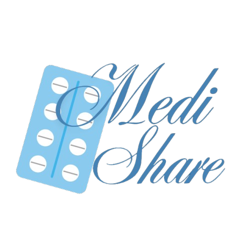

# Projeto Mobile 2025.2 - MediShare (APP para doação de remédios)

## Sobre o projeto
O projeto ‘MediShare’ tem como objetivo desenvolver um aplicativo colaborativo e acessível para a doação e compartilhamento de medicamentos, promovendo solidariedade, reduzindo desperdícios e facilitando o acesso de pessoas a remédios que necessitam, de forma prática e segura.

## Entrega parcial
- Documento em PDF
- Protótipos do Figma
- APK Parcial
- Link do GitHub

## Anexos
- [Acesse o protótipo no Figma](https://www.figma.com/design/jbhoCtTo8c47DBClJmWfCe/MediShare?node-id=0-1&t=EwPQle0mdrxsSBmi-1)
- [Baixe o APK Parcial](./app-debug.apk)

## Equipe
- Maria Clara Martinez Bassi Portela
- Lucas Barros Mourão Silva